# song-to-image

This is a lightweight app that takes a given song title and artist, and generates an image using `stable-diffusion`. 
The image is inspired by the given song's lyrics. 

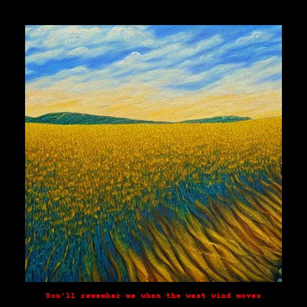

## Installation
Clone the repo and install the requirements. 
```python
pip install -r requirements.txt
```

### Tokens
To use this app, you'll need a Genius API access token and a Hugging Face access token. 

#### Genius API
1. First, sign up for a free account that authorizes access to [the Genius API](https://genius.com/api-clients).
2. Then go to the API section on Genius and [create a new API client](https://genius.com/api-clients/new)
3. After creating your client, generate an access token. 

#### Hugging Face
1. Sign up for [Hugging Face](https://huggingface.co), create an account and confirm your email
2. Follow the instructions to [create a Hugging Face token](https://huggingface.co/docs/hub/security-tokens#:~:text=To%20create%20an%20access%20token,clicking%20on%20the%20Manage%20button.)

### Create an `.env` file
Next, you'll need to create an `.env` file and insert these tokens. Create the empty file:
```commandline
touch .env
```
Insert your tokens:
```
GENIUS_TOKEN="<your_genius_token>"
HF_TOKEN="<your_hugging_face_token>"
```

Now you're good to go!

## Usage
Run `main.py` with separate arguments for the song title and artist.
```python
python main.py "<song_title>" "<artist>" "<summarizer>" --magic_prompt
```

### Optional: Summarizer Model

A third optional argument may be provided to specify the type of summarizer model. 
This model is used to extract the most prominant line from the song's lyrics.
Currently there are three options:
- `luhn`
- `lsa`
- `lexrank`

This defaults to `luhn` if no argument is provided.

Results may differ depending on the chosen model. For example:

|                      Argument                       |                 Result                 |
|:---------------------------------------------------:|:--------------------------------------:|
 | `python main.py "teenage dirtbag" "wheatus" "luhn"` | 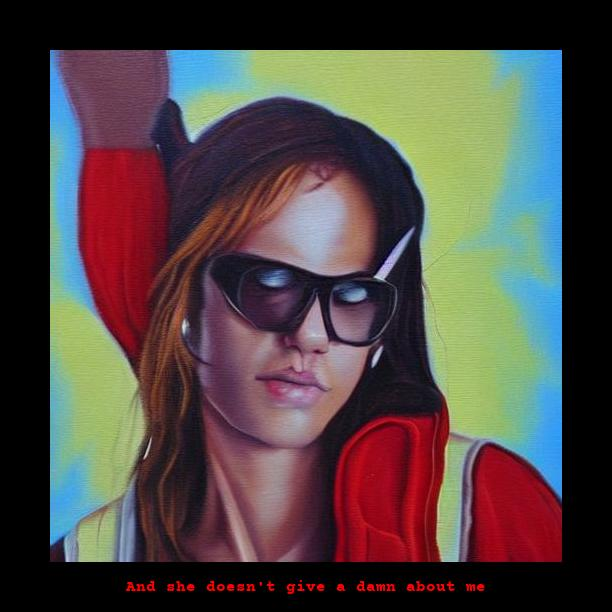 |
| `python main.py "teenage dirtbag" "wheatus" "lsa"`  | 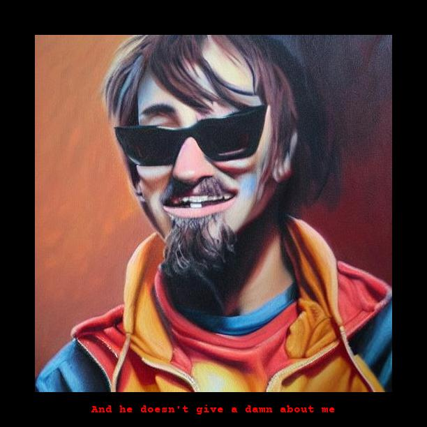  |

In this case the difference in text extraction is subtle. In others it may be more prominent. 

### Optional: MagicPrompt

An additional optional flag may be provided: `--magic_prompt`. 
This uses the [Gustavosta/MagicPrompt-Stable-Diffusion](https://huggingface.co/Gustavosta/MagicPrompt-Stable-Diffusion) 
model via Hugging Face to 'enhance' the image prompt. This model has been trained on tens of thousands of 
`stable-diffusion` prompts. 

This method is still under experimentation to determine its best usage. The results for MagicPrompt are currently less 
consistent, can often veer away from the subject matter and have a suspicious tendency towards anime (though this is 
reduced slightly by filtering out references to artstation). 


|                         |                  Extracted Lyric                  |                                                                                                          MagicPrompt                                                                                                          |                 Result                 |
|:-----------------------:|:-------------------------------------------------:|:-----------------------------------------------------------------------------------------------------------------------------------------------------------------------------------------------------------------------------:|:--------------------------------------:|
 | GOOD :heavy_check_mark: |     `This is the place my heart longs to be`      | `This is the place my heart longs to be stopped By sophie anderson and bill ward, dramatic light, city background, sunset, neuromancer, blade runner, hyperrealistic, blade runner 2 0 4 9 Man In Room 39, The Arcadian Wild` | 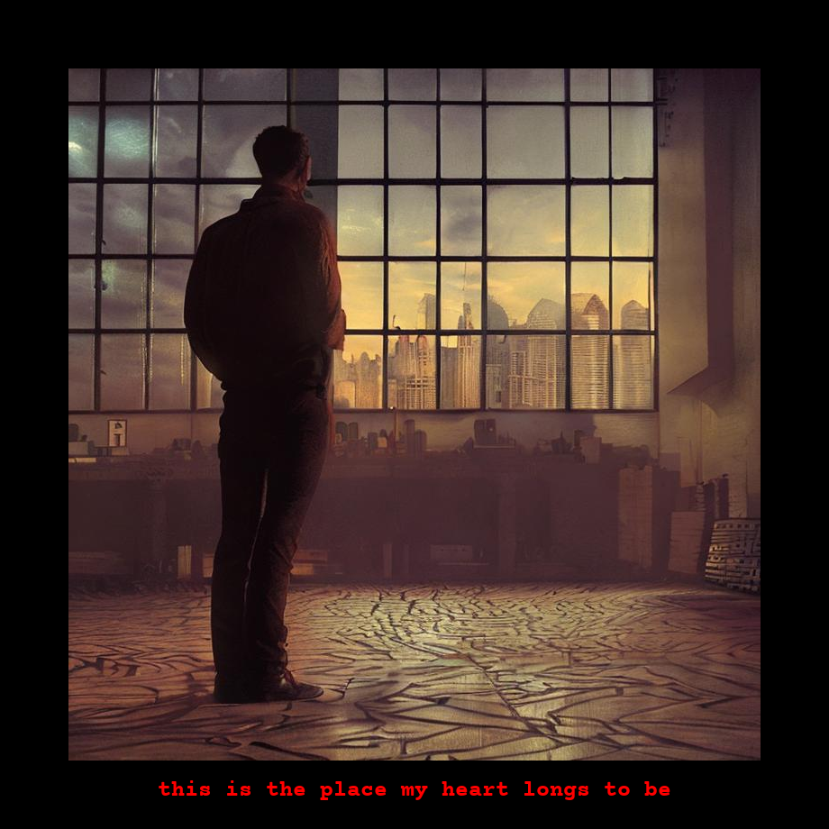 | 
|         BAD :x:         | `But I won't stay on the shelf 'til the next one` |                                                           `But I won't stay on the shelf 'til the next one starts to pour bleach, Out Of Love, Busty And The Bass`                                                            |  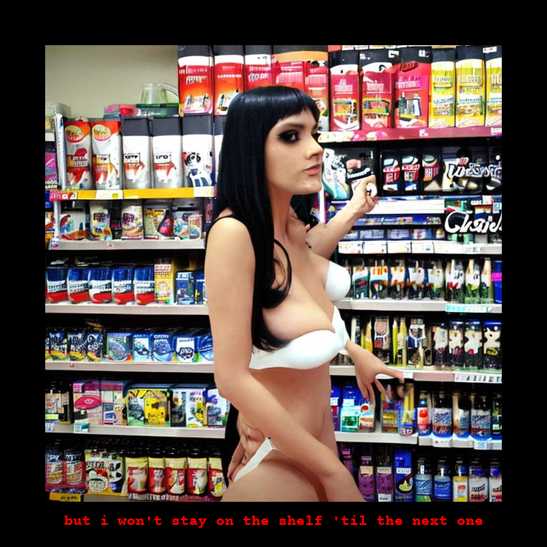   |


## Design
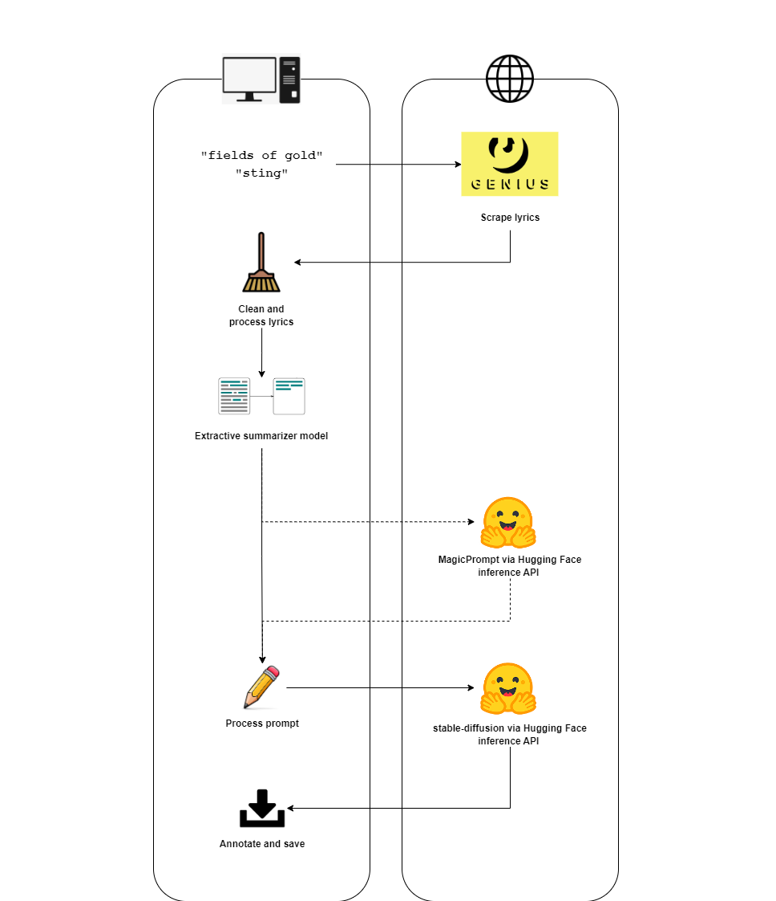

The script takes a song title and artist as compulsory artists. 
The Genius API is used via the `lyricsgenius` wrapper to webscrape the song lyrics. 
This process can be reasonably messy, so some processing is required to clean the body of text. 

Next, an extractive summarizer model is used to choose a central, prominent lyric. 
This lyric is used as part of the image prompt, along with the song title and artist. 

The image is generated by `post`-ing the prompt to `stable-diffusion-2-1` via the Hugging Face inference API. 
This API is rate limited and doesn't afford as much flexibility compared to accessing the model via `transformers`, but 
I'm keen to keep this project lightweight instead of downloading huge model weights. 

The returned image is annotated with the central lyric and saved. 
If the lyric is too long to fit onto the image, the border width is increased and the text is wrapped.

## Gallery

|              Landslide by Fleetwood Mac               |
|:-----------------------------------------------------:|
| 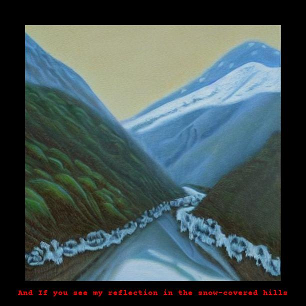 |

|                  October Sky by Yebba                   |
|:-------------------------------------------------------:|
| 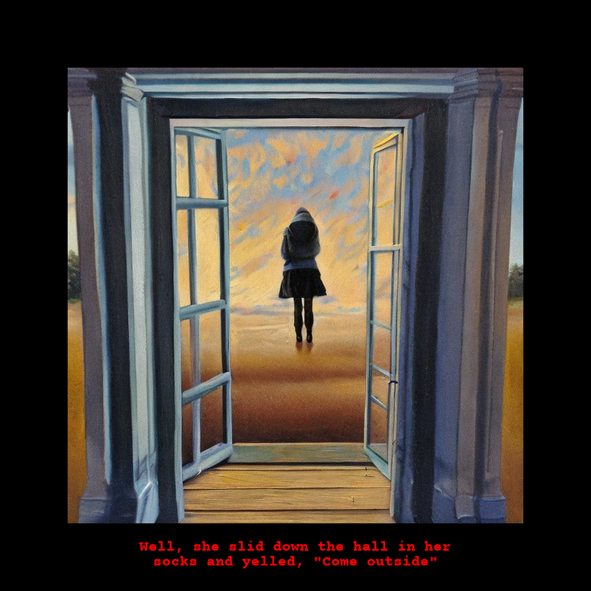 |

|                   Grand Theft Autumn by Fall Out Boy                   |
|:----------------------------------------------------------------------:|
| 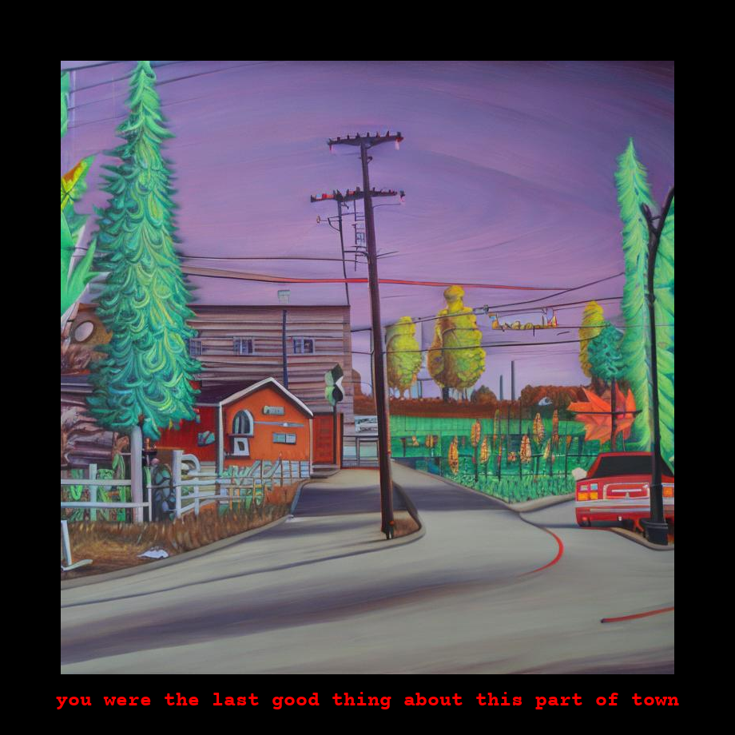 |

|                  Bohemian Rhapsody by Queen                   |
|:-------------------------------------------------------------:|
| 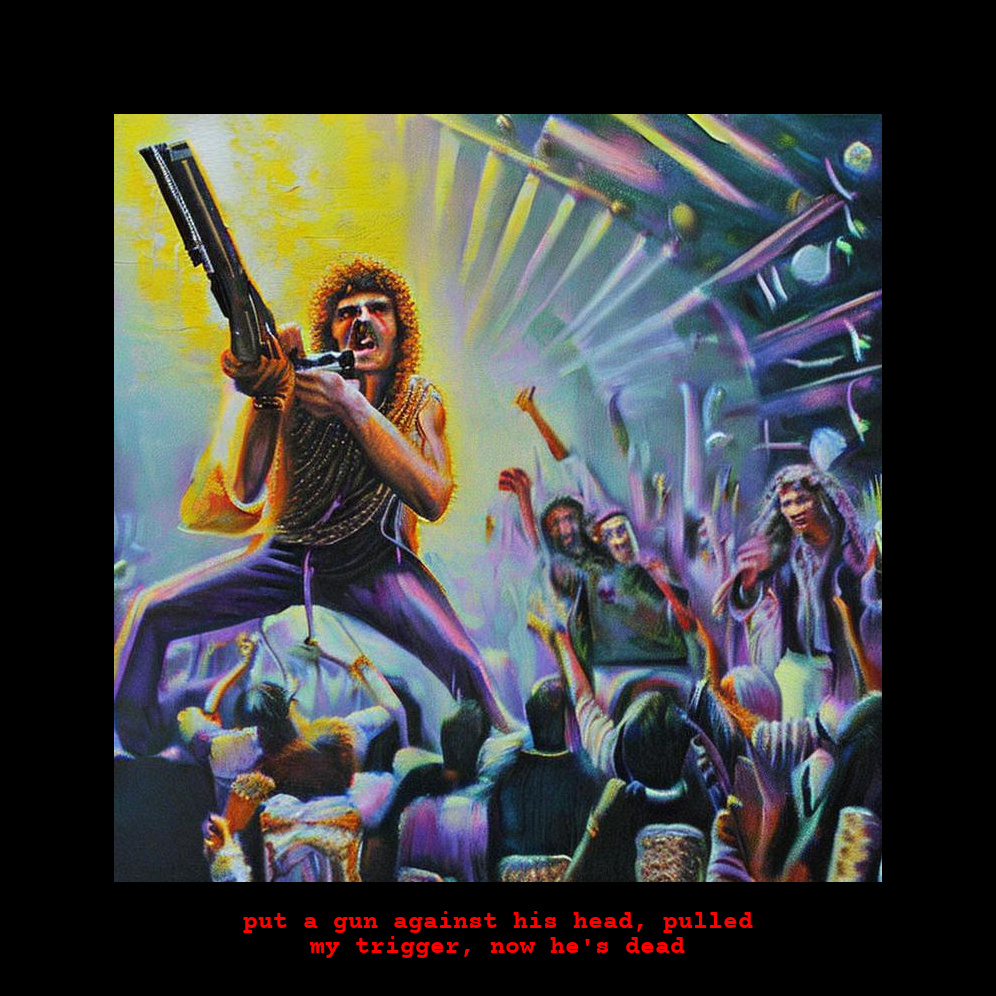 |

|              Queen Mab by Becca Stevens               |
|:-----------------------------------------------------:|
| 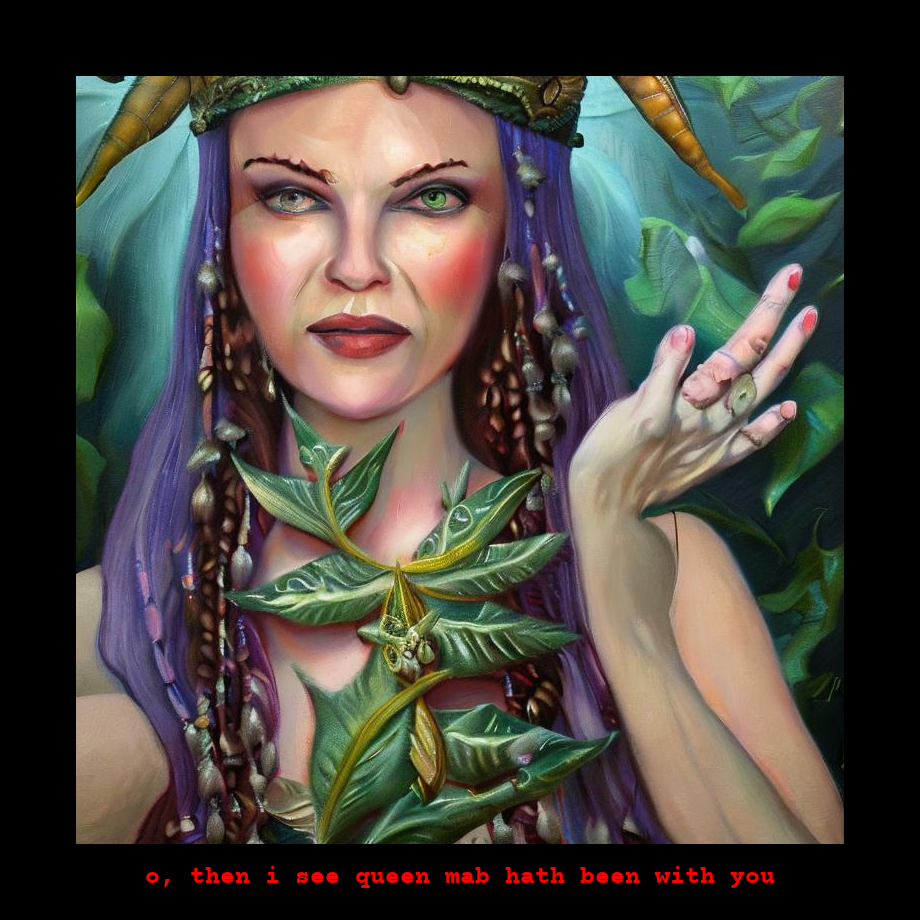 |

## Next Steps

### Experiment with more complex prompt engineering
- Use a [prompt generator model](https://huggingface.co/succinctly/text2image-prompt-generator) from Hugging Face to 
expand the prompt
- Aim to extract a particularly descriptive and noun-heavy line via summarizer
- Define more hyperparameters via inference API
- Currently the prompts are set to 'oil painting'; experiment with other styles such as 'concept art'

### Experiment with more thorough text cleaning
- Strip the lyrics to plaintext and use a 
[punctuator model](https://huggingface.co/oliverguhr/fullstop-punctuation-multilang-large?text=Yet+she+blushed+as+if+with+guilt+when+Cynthia+reading+her+thoughts+said+to+her+one+day+Molly+you%27re+very+glad+to+get+rid+of+us+are+not+you) to convert lyrics to prose. This may be more compatible with summarizer models.
- ~~Remove contents of brackets from lyrics. This is often `("whoah-oh)` or something similar.~~

### Deploy as a web app with smooth UX
- Add Spotify login
- Allow users to generate images for their most-played songs, etc
- Create a 'scrapbook' of images for a given playlist

### Other
- Add arg to compare text prompts across all summarizer models before committing to generating the image
- Add arg to choose `stable-diffusion` version, possibly other text-to-image models 